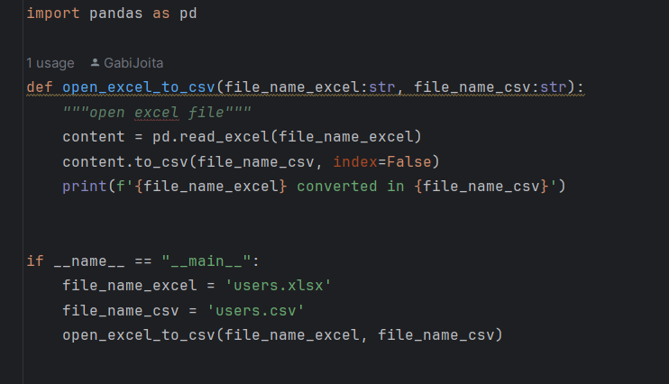

# Convert a file from xlsx to csv

> quote

A preview code:
```
import pandas as pd

def open_excel_to_csv():
    pass
    
if __name__ == "__main__":
    pass
```
Importan:
```
Make sure you installed pandas library 

es:
pip install pandas
```

