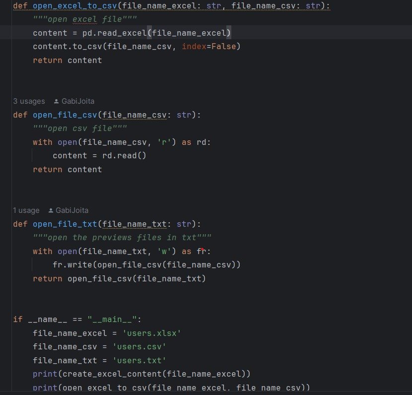

# Convert a file from xlsx to csv

> quote

Note:
```
This project contains 2 python apllications, one which can use to create
a file and open it, and we can use the second, to open the file 
as an input.
```

A preview code:
```
import pandas as pd

def open_excel_to_csv():
    pass
    
if __name__ == "__main__":
    pass
```
Important:
```
Make sure you installed pandas library 

es:
pip install pandas
```

